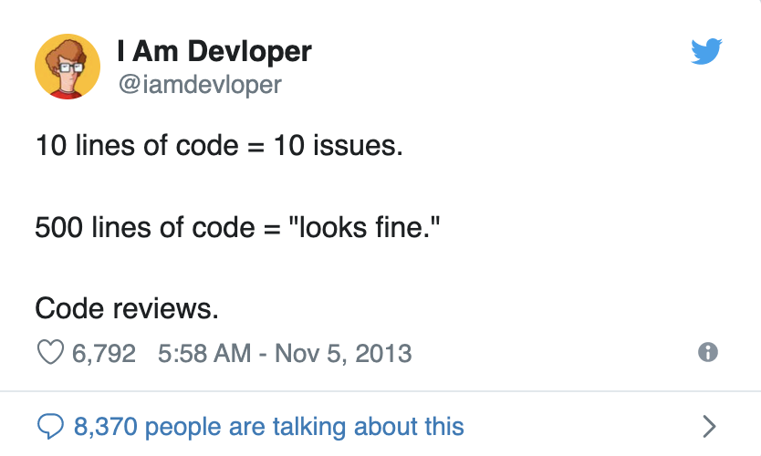

# Development Guidelines

This file serves as a guide for project group members contributing to this project, outlining agreed practices to ensure smooth and organized development workflow.

### Documentation and Testing

- With each code increment (PR), we strive to provide relevant documentation. This could be in the form of updates to the main `README.md` file in root or as docstrings within the code itself.
- We also aim to provide tests where possible to validate the functionality of the new code and ensure it doesn't break existing functionality.

### Branching Strategy

- We create a separate branch for each feature or bug fix.
- Branch names are named in the following format: `username/feature_description`.
- We remove branches after merging.

### Pull Request Reviewing

- Only one approval is enough for a pull request (second approve could also come, but it's not necessary for merge).
- The branch owner is performing the merge.

### Pull Request Size

- To facilitate easier code review, we aim to keep our pull requests small and focused.
- If a feature or bug fix requires a large amount of changes, we should divide these changes into several smaller pull requests.
{:width="300px" height="200px"}