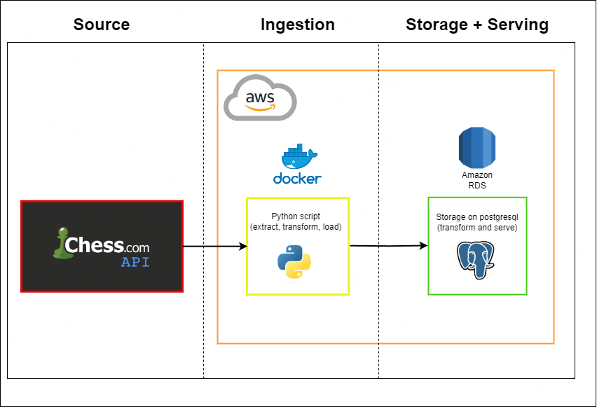
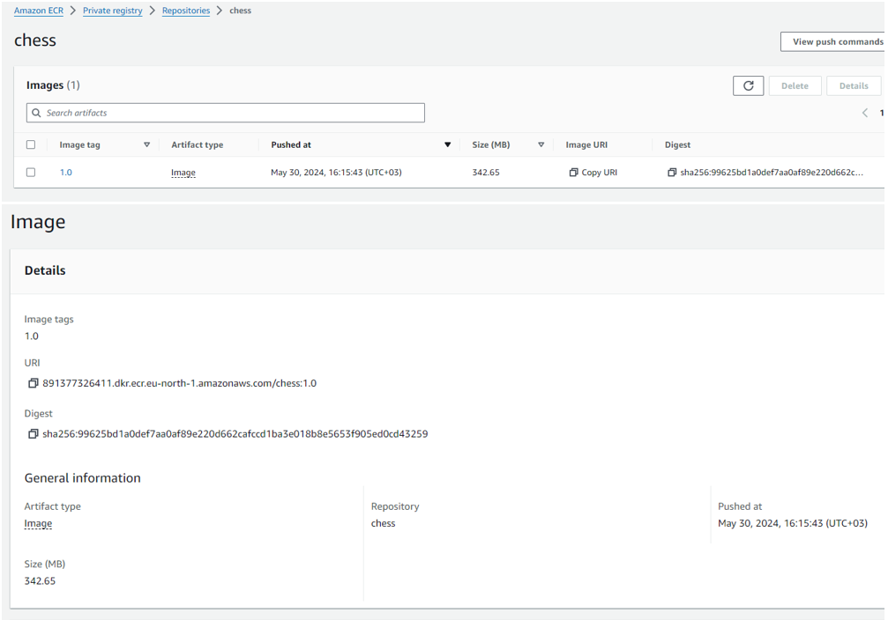
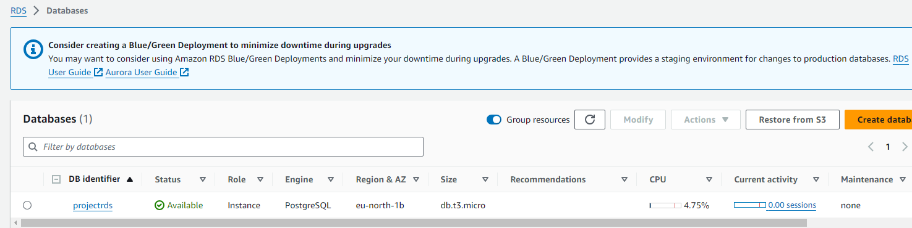
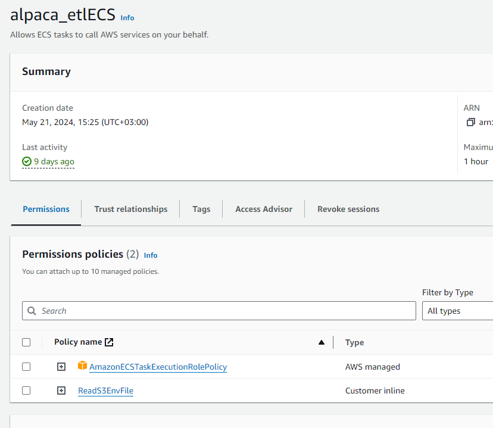
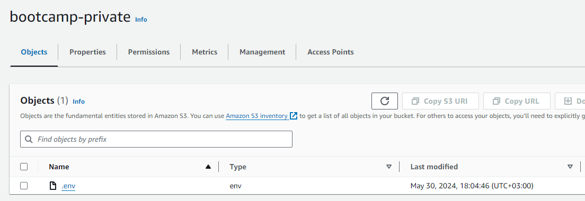
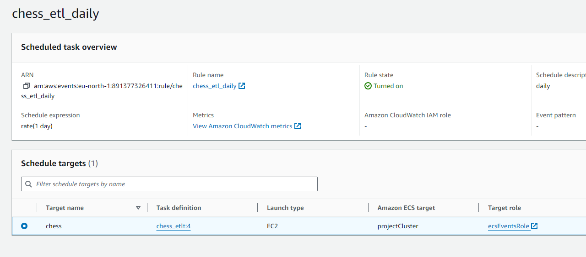

# Chess\.com EtLT project

## About

<div style="overflow: auto;">
    
    <p>This project is designed to extract data from the Chess.com API, transform it, and load it into a PostgreSQL database. This project is called "EtLT" because we used some in-memory transformations (before the load to db) and transformations within the PostgreSQL to precalculate some analysis.</p>
    <p>The goal of this project was to enable efficient data analysis and discover valuable insights, trends, and statistical information pertaining to chess.com games archive. This is achieved by implementing a modern and robust pipeline that aligns with the principles of data engineering, allowing for the application and enhancement of our acquired skills.</p>
    <p>Code owners of this repository (project) are:</p>
    <ul>
    <li><a href="https://github.com/danihello">Daniel Premisler</a></li>
    <li><a href="https://github.com/yagvendrajoshi">Yagvendra Joshi</a></li>
    <li><a href="https://github.com/NikiforSokolov">Nikifor Sokolov</a></li>
    </ul>
</div>

## Data sources

The main data source for this project is the public API of Chess.com ([official documentation](https://www.chess.com/news/view/published-data-api) and [community guide](https://www.chess.com/clubs/forum/view/guide-unofficial-api-documentation])). We extract various types of data, including game archives, player information, statistics, and more. The API calls/objects we use include:

- `https://api.chess.com/pub/player/{username}/stats`
- `https://api.chess.com/pub/player/{username}/games/archives`
- `https://api.chess.com/pub/player/{username}/games/{YYYY}/{MM}`
- `https://api.chess.com/pub/player/{username}`

Also, there is a one-off data source `eco_codes.csv` which was created manually and contains information about opennings with their codes (used for data enrichment).

## Documentation

This readme serves as the high-level documentation overview. For detailed explanations of individual functions and classes, please refer to the code itself (`docstring` is used for annotating funcations).

On top of it, there are following useful artifacts in this project:
- [Development Guidelines](docs/development_guidelines.md): The standards and principles our group members have agreed on to streamline the development process.
- [Data Dictionary](docs/data_dictionary.md): Detailed descriptions of all data columns and tables used in the project (both sourse and serve objects).

## Design

### Design Overview

The proposed architecture for the Chess.com data extraction and storage project is designed to facilitate seamless data ingestion, transformation, and storage. The primary components of the architecture are divided into three main sections: Source, Ingestion, and Storage + Serving.



<b><font size="3">Source</font> </b>

- <b>Chess.com API:</b> The source of our data is the Chess.com API, a robust and comprehensive API that provides access to a wide range of data related to chess games, player information, statistics, and other relevant details.

<b><font size="3">Ingestion</font> </b>

- <b>AWS:</b> The architecture leverages AWS cloud services for scalable and reliable data processing and storage. AWS provides the infrastructure necessary for running the Docker container and the Python scripts used for data ingestion.
- <b>Docker:</b> Docker is used to containerize the Python script, ensuring a consistent and reproducible environment for the ETL/ELT process. This containerization allows for easy deployment and scaling of the ingestion process.

- <b>Python Script:</b> A custom Python script is responsible for extracting, transforming, and loading (ETL) the data from the Chess.com API. This script performs the following tasks:
  - <b>Extract:</b> Connects to the Chess.com API and retrieves the required data,   including game archives, player information, and statistics.
  - <b>Transform:</b> Processes the raw data to clean, normalize, and aggregate it into a format suitable for analysis.
  - <b>Load:</b> Loads the transformed data into a PostgreSQL database for storage and further processing.

<b><font size="3">Storage + Serving</font> </b>

- <b>Amazon RDS:</b> Amazon RDS is used to host the PostgreSQL database, providing a scalable and managed relational database solution. RDS ensures high availability, security, and automated backups.
- <b>PostgreSQL:</b> The transformed data is stored in a PostgreSQL database. This database is designed to support complex queries and analytics, providing pre-built aggregated tables ready for end-user consumption. The data stored in PostgreSQL will facilitate analysis by analytics and data science teams, enabling them to uncover patterns, trends, and statistics.

### ETL and ELT Patterns

The architecture employs both ETL (Extract, Transform, Load) and ELT (Extract, Load, Transform) patterns to ensure efficient data processing and storage. Below are some key parts of selected patterns:

1. **Extraction**: The Python script connects to the Chess.com API and retrieves the required data, including game archives, player information, and statistics. This is done in the `extract_games` and `extract_user_info` functions.
2. **Incremental Extraction**: The script uses an incremental extraction approach for game data to capture only the changes since the last update. This is handled in the `incremental_modify_dates` function.
3. **Transformation**: The raw data is processed to parsed, clean, normalize, and aggregate it into a format suitable for analysis. This is done in the transform_etl and transform_players functions.
4. **Loading**: The transformed data is loaded into a PostgreSQL database for storage and further processing. This is done in the `load` method of the `PostgresClient` class.
5. **ELT**: We've added some transformations after the data loading process in our classic ETL approach. This is to create materialized tables with pre-calculated analytics, making it easier for downstream teams to use the data. These transformations are applied to data that has already been uploaded by the ETL process.
6. **Upsert Approach**: For user information and statistics, an upsert approach is used to ensure that new and updated records are accurately reflected in the database. This is handled in the `load` function with the `load_method` parameter set to "upsert" or "insert".

<b><font size="3">ETL</font> </b>

In the ETL process, data is first extracted from the Chess.com API, then transformed into a suitable format, and finally loaded into the PostgreSQL database. This pattern is beneficial when data needs to be processed and transformed before storage, ensuring that only clean and aggregated data is stored in the database.

<b><font size="3">ELT</font> </b>

In the ELT process, data is extracted from the Chess.com API and directly loaded into the PostgreSQL database in its raw form. The transformation is then performed within the database using SQL queries and stored procedures. This pattern is useful when the database has sufficient processing power to handle large-scale transformations, allowing for more flexible and scalable data processing.

By combining ETL and ELT patterns, the architecture ensures efficient and flexible data processing, enabling the analytics and data science teams to perform complex analyses and derive valuable insights from the data.

### Conclusion

The proposed architecture provides a robust and scalable solution for extracting, transforming, and storing data from the Chess.com API. By leveraging AWS, Docker, and PostgreSQL, the architecture ensures reliable and efficient data processing, making it easier for analytics and data science teams to uncover valuable insights and trends from the chess data.

## Running instructions

This pipeline could be executed in two modes: run module as a script locally and in a Docker container (both building and pulling an image). Here are the running instructions for each option.

<details>
<summary>
 Local execution
</summary>

**Prerequisites**:
1. You need to have postresql v14 installed on your machine. It should have `postgres` db with a password `postgres`.
2. You need to satisfy requirements specified in the `app/requirements.txt`.

**Steps**:
1. You can run the pipeline by executing `python -m pipelines.Chess` command in your terminal
2. For local execution (running module as a script) use the `.env` file located within `/app` directory. It has `localhost` reference for postgresql. I.e., you don't need to do any extra step here.
3. You will be able to see both processed data and relevant logs in `postgres.public` schema in your PGAdmin.

</details>

<details>
<summary>
 Docker Container
</summary>

**Prerequisites**:
1. You need to have postresql v14 installed on your machine. It should have `postgres` db with a password `postgres`.
2. You also need to have Docker Desktop installed and running.


**Steps for building**:
1. From the root directory run command `docker build -t <image_name>:<version> .`.
2. For starting a container, use `.env` file from the root. It has correct references for PostreSQL db host. Your terminal command could be:
```bash
docker run --env-file .env --name=<container_name> <image_name>:<version>
```

**Steps for pulling**:
1. You can pull the latest image of this pipeline by executing `docker pull danihello/chess:2.0`.
2. For starting a container, use `.env` file from the root of this repo. It has correct references for PostreSQL db host. Your terminal command could be:
```bash
docker run --env-file .env --name=<container_name> <image_name>:<version>
```
</details>

## AWS execution

This pipeline was also deployed to AWS to run on cloud. The screenshots of artifacts could be found under the spoiler.

<details>
<summary>
 ETL - Elastic Container Registry (ECR) - Image
</summary>


</details>

<details>
<summary>
 Storage solution - Relational Database Service (RDS)
</summary>


</details>

<details>
<summary>
 IAM Role
</summary>


</details>

<details>
<summary>
 Envionment variables - S3
</summary>


</details>

<details>
<summary>
 Task Scheduler - Elastic Container Service (ECS)
</summary>


</details>

## Lessons Learned

1. Be careful about using company’s laptop – if there is more secured network setting, SSL certificate issue might arise.
2. Working on the git with branching and reviews, learning how to collaborate with peers.
3. Working with `path` package for interactive mode, allowing to run script in the jupiter-like interactive notebook.